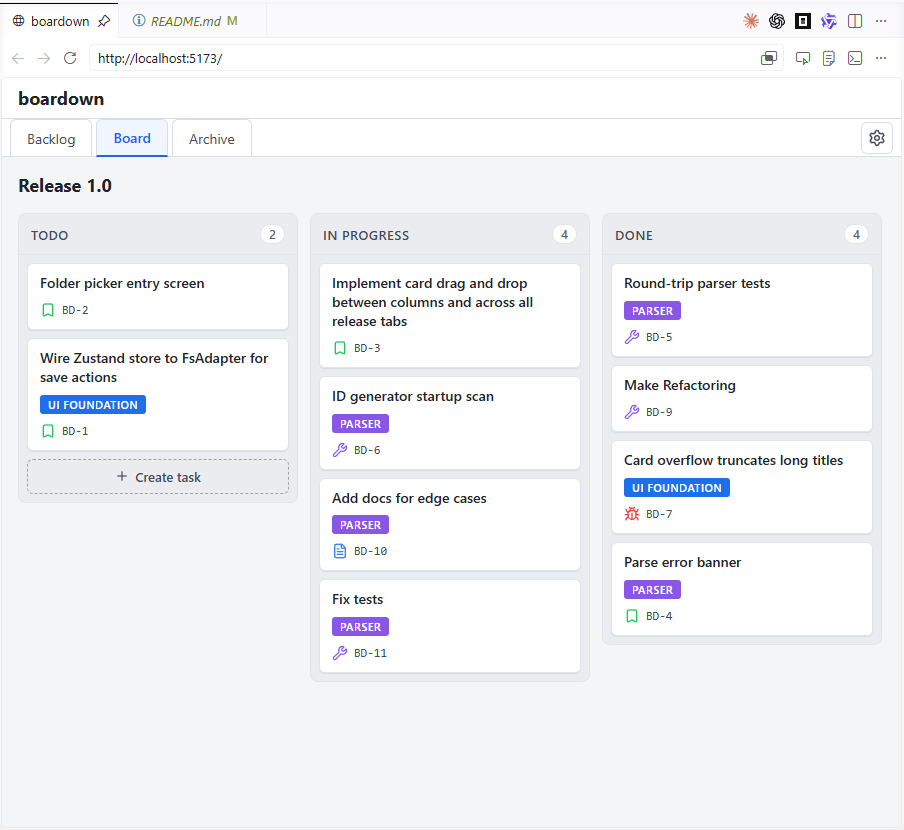
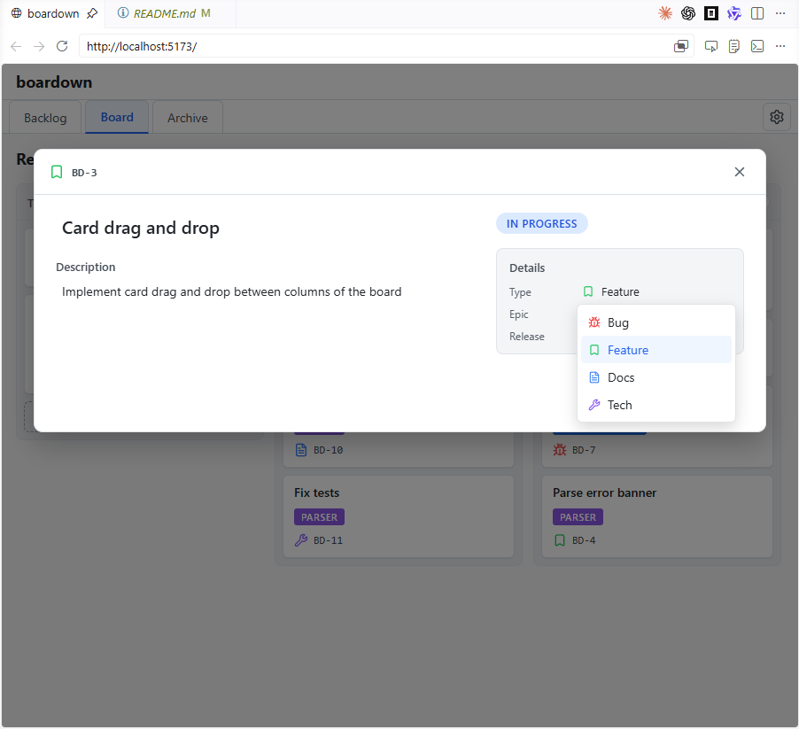

# boardown

> 🚧 **Status: work in progress.** The VS Code extension now packages into an
> installable `.vsix` (see [below](#vs-code-extension)); boardown can also be
> used from sources via the local web shell.

A local-first task board that stores its data as plain markdown files inside
your project's git repo. Releases, epics and tasks live in `.boardown/` next
to your code, so they version, branch and diff with the rest of the project —
no cloud, no server, no account.

The primary MVP target is a **VS Code extension** that reads `.boardown/`
from the open workspace. While that extension is being built, the browser app
in this repo (`packages/web`) can run locally against any `.boardown/` data
directory, which works well in VS Code's built-in browser panel. An Electron
build is post-MVP.

<p align="center">
  
</p>

<p align="center">
  
</p>

See [PRODUCT.md](./PRODUCT.md) for the full spec and the MVP roadmap.

## VS Code extension

The extension is the primary MVP target. To build an installable `.vsix` from
sources:

```sh
pnpm install
pnpm --filter boardown package
```

This produces `packages/vscode/build/boardown-<version>.vsix`. Install it into
VS Code with:

```sh
code --install-extension packages/vscode/build/boardown-0.1.0.vsix
```

Then open a folder and click the board icon in the top-right corner of the
editor, or run **Boardown: Open Board** from the Command Palette.
(Marketplace publishing is not set up yet — the `publisher` and icon are
placeholders.)

## Try it from sources

Install dependencies once:

```sh
pnpm install
```

Start boardown against this repo's sample `.boardown/`:

```sh
pnpm dev
```

Or open another project by pointing `--data-dir` at that project's `.boardown/`
directory:

```sh
pnpm dev -- --data-dir /path/to/project/.boardown
```

Then open `http://localhost:5173` in a browser. In VS Code, run
**Simple Browser: Show** from the Command Palette, enter
`http://localhost:5173`, and pin the tab if you want it to behave like a local
board panel.

If the selected `.boardown/` has no `config.yaml`, the web shell creates the
default structure automatically with `idPrefix: TASK`. Create `config.yaml`
manually before first launch if you want a different prefix.

## Development

Requirements:

- Node.js **>= 20** (the repo pins `20` via `.nvmrc`; Node 22 also works)
- pnpm **10+** (`npm install -g pnpm` or via `corepack`)

Install dependencies once if you skipped the quick start above:

```sh
pnpm install
```

The repo is a pnpm workspace with four packages:

- [`packages/core`](./packages/core) — platform-agnostic logic (schemas,
  parser, board operations). Pure TypeScript, runs in Node.
- [`packages/ui`](./packages/ui) — the React app: components, Zustand store,
  UI flow. Takes an `FsAdapter` as input, knows nothing about the host.
  Source-only (consumed directly by the shell's bundler).
- [`packages/web`](./packages/web) — dev-only browser shell: Vite app that
  mounts `@boardown/ui` over a Vite middleware which serves a local
  `.boardown/` data directory. Used for iterating on the UI from sources.
- [`packages/vscode`](./packages/vscode) — the primary MVP distribution target,
  a VS Code extension shell next to `web` (extension host via esbuild + webview
  via Vite), reusing `@boardown/ui` unchanged. Packages into an installable
  `.vsix` (see [VS Code extension](#vs-code-extension) above).

A `packages/electron` shell is post-MVP.

### Common scripts (run from the repo root)

| Command            | What it does                                              |
|--------------------|-----------------------------------------------------------|
| `pnpm dev`         | Start the web dev server against this repo's `.boardown/` (Vite, `http://localhost:5173`) |
| `pnpm build`       | Build the shells that have a `build` script (web → Vite bundle, vscode → host + webview); `core` and `ui` are source-only and skipped |
| `pnpm test`        | Run Vitest across all packages                            |
| `pnpm typecheck`   | Run `tsc --noEmit` in every package                       |
| `pnpm lint`        | Run ESLint over the workspace                             |
| `pnpm format`      | Apply Prettier in-place                                   |
| `pnpm format:check`| Check Prettier formatting without writing                 |

### Running a single package

Use pnpm's `--filter`:

```sh
pnpm --filter @boardown/web dev      # only the web dev server
pnpm --filter @boardown/core build   # only the core build
pnpm --filter @boardown/core test    # only core tests
pnpm --filter @boardown/ui test      # only ui tests
```

The dev server runs in any modern browser — it talks to the selected
`.boardown/` over a local Vite middleware, so no File System Access API or
Chromium-only feature is involved.

To open another boardown data directory from sources, pass `--data-dir`. The
path must point to the `.boardown` directory itself, not to the project root:

```sh
pnpm dev -- --data-dir /path/to/project/.boardown
```

If `--data-dir` is omitted, boardown uses this repository's `.boardown/`, same
as before. Relative `--data-dir` paths are resolved from the directory where
you run the command.

### Sample board for the dev server

The repo ships a `.boardown/` folder at the root with a minimal config and a
couple of empty releases / epics. `pnpm dev` reads the selected data directory
via a small Vite middleware that exposes `/api/fs/{read,list,stat,write}` over
HTTP, and `@boardown/ui` mounts on top of a `DevHttpFsAdapter` that talks to
those endpoints. This is the working environment for UI development and local
use from sources; a production browser deployment (folder picker, FS Access
API or otherwise) is not in the MVP scope.

When the selected data directory has no `config.yaml`, the shell does **not**
seed a config or a starter release. Instead `@boardown/ui` shows an onboarding
modal that collects the project name and ID prefix and writes
`.boardown/config.yaml` on submit (`nextId` starts at `1`). After onboarding the
board starts empty and opens on the Backlog tab — create your first release from
the UI. The web dev shell only ensures the board root directory exists.

## Releasing

The whole monorepo ships under **one lockstep version**: the same number lives
in every `package.json`, with the **root `package.json` as the single source of
truth**. There is only one distributed artifact today (the `.vsix`), and future
shells (web, Electron, JetBrains) will release together under the same version.

Releases are driven by a version bump on `main`, not by pushing tags by hand:

1. Bump the version and commit it:

   ```sh
   pnpm release:prepare patch     # or minor / major / an explicit 0.3.0
   pnpm release:rc                # cut a 0.3.0-rc.1 prerelease
   ```

   This updates the root version, mirrors it into every package, and creates a
   `chore(release): vX.Y.Z` commit (no tag).

2. Push to `main`:

   ```sh
   git push origin main
   ```

3. The [`Publish`](./.github/workflows/publish.yml) workflow notices that the
   tag `vX.Y.Z` for the current version does not exist yet, runs the checks,
   builds the `.vsix`, generates release notes from the commit log, creates and
   pushes the tag, and publishes a GitHub Release with the `.vsix` in **Assets**.
   If the tag already exists (no version bump), the workflow skips the release.

boardown tracks its own work on a board stored in `.boardown/`. Commits that
only touch that board data use the `chore(board): …` scope and are excluded
from the generated release notes (just like the `chore(release): …` bump
commit), so dog-fooding the board never clutters a user-facing changelog.

Preview the notes that would be generated for the current version with:

```sh
pnpm release:notes:preview
```

Every push and pull request to `main` also runs the
[`CI`](./.github/workflows/ci.yml) workflow (lint, typecheck, build, test).

## License

[MIT](./LICENSE)
