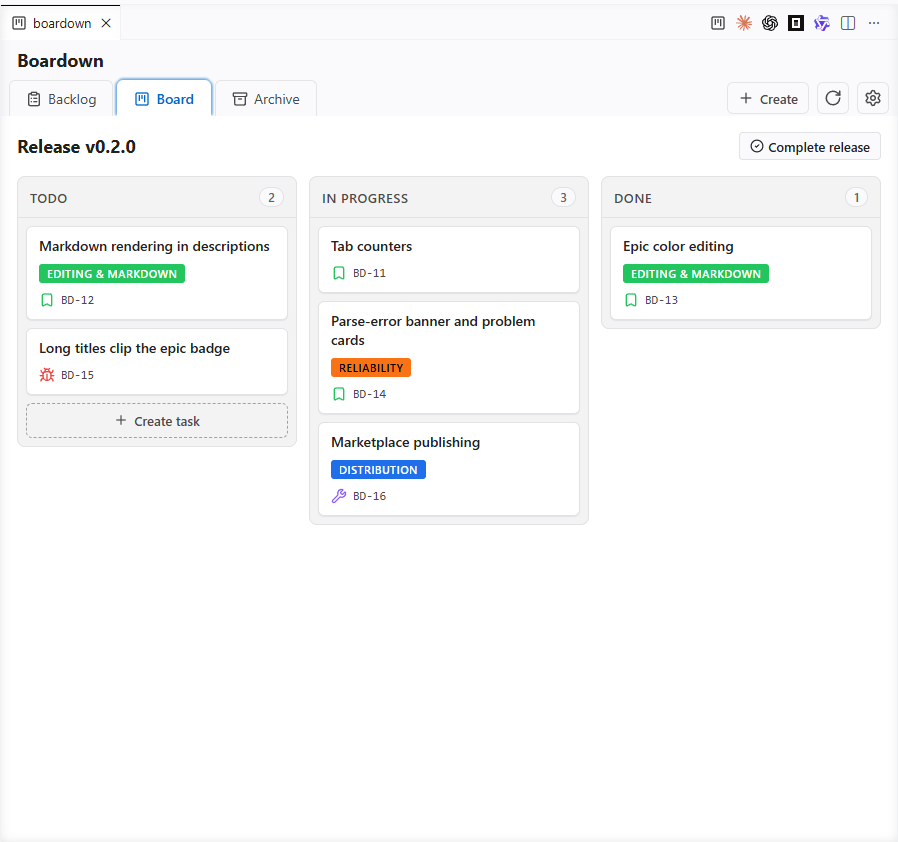
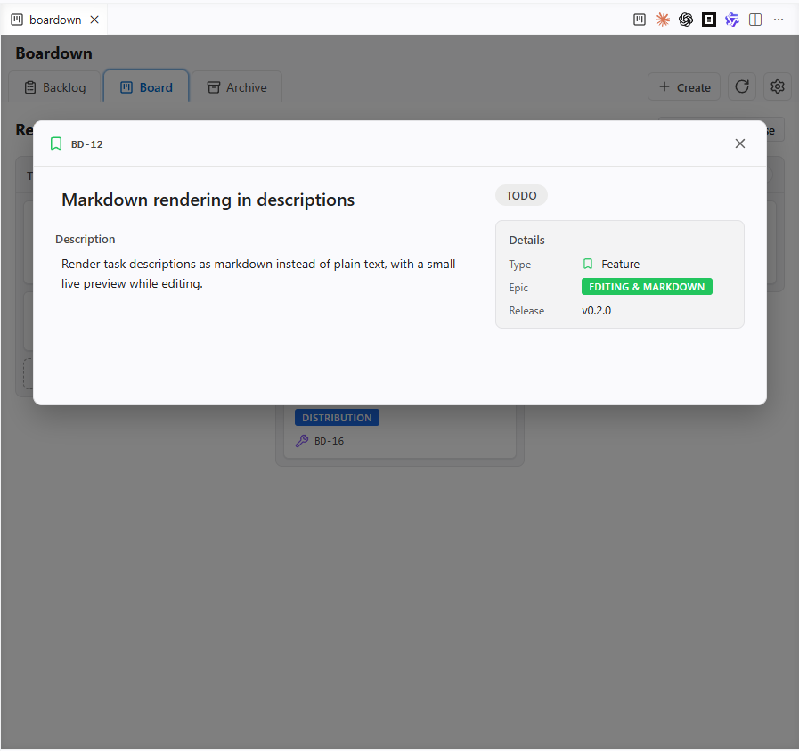
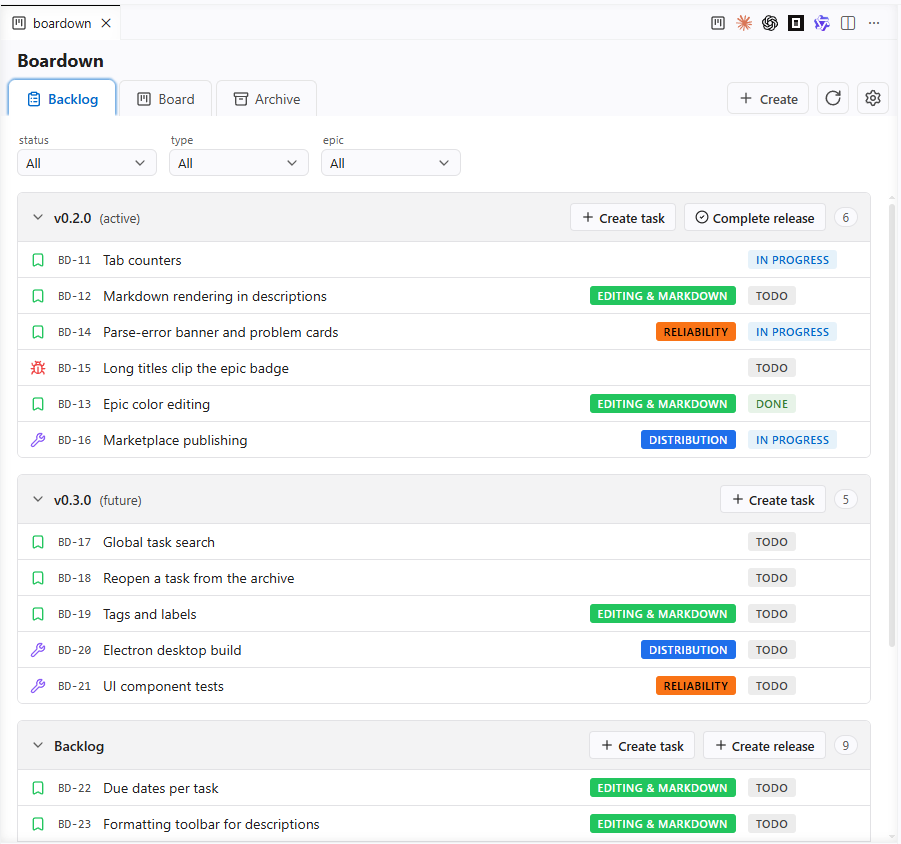

# boardown

[](https://github.com/grinev/boardown/actions/workflows/ci.yml)
[](./LICENSE)
[](https://pnpm.io)
[](https://nodejs.org)

A local-first task board that stores its data as plain markdown files inside
your project's git repo. Releases, epics and tasks live in `.boardown/` next
to your code, so they version, branch and diff with the rest of the project —
no cloud, no server, no account.

boardown ships two ways: a **VS Code extension** that reads `.boardown/` from
the open workspace, and a **standalone desktop app** (Windows / macOS / Linux)
that opens any project folder. Both reuse the same board UI and read the same
markdown files.

<p align="center">
  
</p>

<p align="center">
  
</p>

<p align="center">
  
</p>

See [PRODUCT.md](./PRODUCT.md) for the full spec and the roadmap.

## Installation

boardown comes as a VS Code extension and a desktop app — pick whichever fits
your workflow. The extension lives on the
[VS Code Marketplace](https://marketplace.visualstudio.com/items?itemName=grinev.boardown);
the desktop app is attached to each
[GitHub Release](https://github.com/grinev/boardown/releases). Both open the
same `.boardown/` board.

### VS Code extension

Install **boardown** straight from the
[VS Code Marketplace](https://marketplace.visualstudio.com/items?itemName=grinev.boardown):
open the **Extensions** view (`Ctrl+Shift+X` / `Cmd+Shift+X`), search for
`boardown`, and click **Install**. Or from the command line:

```sh
code --install-extension grinev.boardown
```

Prefer to install from a `.vsix`? Each
[GitHub Release](https://github.com/grinev/boardown/releases) attaches one:

1. Download `boardown-<version>.vsix` from the latest release's **Assets**.
2. Open VS Code and go to the **Extensions** view (`Ctrl+Shift+X` /
   `Cmd+Shift+X`).
3. Click the **`…`** menu at the top of the Extensions panel and choose
   **Install from VSIX…**.
4. Select the downloaded `.vsix` file.

Once installed, open your project folder and click the board icon in the
top-right corner of the editor, or run **Boardown: Open Board** from the
Command Palette (`Ctrl+Shift+P` / `Cmd+Shift+P`). If the workspace has no
`.boardown/` folder yet, an onboarding screen walks you through creating the
board.

The open board refreshes itself when its `.boardown/` files change on disk —
switching branches, pulling, editing a file, or running the CLI all update the
board in place, without the Reload button. Turn it off with the
`boardown.autoRefresh` setting.

### Desktop app

Each [GitHub Release](https://github.com/grinev/boardown/releases) also ships a
standalone desktop app (Electron). Grab the file for your OS from the release's
**Assets**:

- **Windows** → `boardown-<version>-win-setup.exe` (installer) or the portable
  `boardown-<version>-win.zip` (unzip and run `boardown.exe`).
- **macOS** → `.dmg` (drag to Applications) or `.zip`. Pick the `arm64` build
  for Apple Silicon or the `x64` build for Intel Macs.
- **Linux** → `.AppImage` (`chmod +x boardown-*.AppImage && ./boardown-*.AppImage`)
  or `.deb` (`sudo dpkg -i boardown-*-linux-amd64.deb`).

The desktop builds are **not code-signed yet**, so the OS warns on first launch.
To run anyway:

- **Windows** — on the SmartScreen prompt, click **More info → Run anyway**.
- **macOS** — right-click the app → **Open** (then confirm), or clear the
  quarantine flag: `xattr -dr com.apple.quarantine /Applications/boardown.app`.
- **Linux** — no prompt; just make the `.AppImage` executable as shown above.

On launch the app shows recent project folders and an **Open Folder…** button;
pick a folder and the board loads from its `.boardown/`.

The board refreshes itself when those files change on disk — from git, an
editor, or the CLI — updating in place without the Reload button. Toggle it
under **Settings → Auto-refresh on file changes** in the sidebar.

## Building the `.vsix` from sources

To build an installable `.vsix` yourself instead of downloading it:

```sh
pnpm install
pnpm --filter boardown package
```

This produces `packages/vscode/build/boardown-<version>.vsix`, which you can
install with the steps above.

## Try it from sources

Install dependencies once:

```sh
pnpm install
```

Start boardown against this repo's sample `.boardown/`:

```sh
pnpm dev
```

Or open another project by pointing `--data-dir` at that project's `.boardown/`
directory:

```sh
pnpm dev -- --data-dir /path/to/project/.boardown
```

Then open `http://localhost:5173` in a browser. In VS Code, run
**Simple Browser: Show** from the Command Palette, enter
`http://localhost:5173`, and pin the tab if you want it to behave like a local
board panel.

If the selected `.boardown/` has no `config.yaml`, the web shell creates the
default structure automatically with `idPrefix: TASK`. Create `config.yaml`
manually before first launch if you want a different prefix.

## Development

Requirements:

- Node.js **>= 20** (the repo pins `20` via `.nvmrc`; Node 22 also works)
- pnpm **10+** (`npm install -g pnpm` or via `corepack`)

Install dependencies once if you skipped the quick start above:

```sh
pnpm install
```

The repo is a pnpm workspace with five packages:

- [`packages/core`](./packages/core) — platform-agnostic logic (schemas,
  parser, board operations). Pure TypeScript, runs in Node.
- [`packages/ui`](./packages/ui) — the React app: components, Zustand store,
  UI flow. Takes an `FsAdapter` as input, knows nothing about the host.
  Source-only (consumed directly by the shell's bundler).
- [`packages/web`](./packages/web) — dev-only browser shell: Vite app that
  mounts `@boardown/ui` over a Vite middleware which serves a local
  `.boardown/` data directory. Used for iterating on the UI from sources.
- [`packages/vscode`](./packages/vscode) — the primary MVP distribution target,
  a VS Code extension shell next to `web` (extension host via esbuild + webview
  via Vite), reusing `@boardown/ui` unchanged. Packages into an installable
  `.vsix` (see [Building the `.vsix` from sources](#building-the-vsix-from-sources) above).
- [`packages/electron`](./packages/electron) — a cross-platform desktop shell
  (macOS / Windows / Linux): an Electron main process + preload behind the same
  `FsAdapter`, with a Vite-built renderer that reuses `@boardown/ui`. See
  [Desktop app (Electron)](#desktop-app-electron) below.

### Common scripts (run from the repo root)

| Command            | What it does                                              |
|--------------------|-----------------------------------------------------------|
| `pnpm dev`         | Start the web dev server against this repo's `.boardown/` (Vite, `http://localhost:5173`) |
| `pnpm build`       | Build the shells that have a `build` script (web → Vite bundle, vscode → host + webview); `core` and `ui` are source-only and skipped |
| `pnpm test`        | Run Vitest across all packages                            |
| `pnpm typecheck`   | Run `tsc --noEmit` in every package                       |
| `pnpm lint`        | Run ESLint over the workspace                             |
| `pnpm format`      | Apply Prettier in-place                                   |
| `pnpm format:check`| Check Prettier formatting without writing                 |
| `pnpm icons`       | Regenerate every shell's app icon from `assets/brand/boardown.svg` (run after changing the logo) |

### Running a single package

Use pnpm's `--filter`:

```sh
pnpm --filter @boardown/web dev      # only the web dev server
pnpm --filter @boardown/core build   # only the core build
pnpm --filter @boardown/core test    # only core tests
pnpm --filter @boardown/ui test      # only ui tests
```

The dev server runs in any modern browser — it talks to the selected
`.boardown/` over a local Vite middleware, so no File System Access API or
Chromium-only feature is involved.

To open another boardown data directory from sources, pass `--data-dir`. The
path must point to the `.boardown` directory itself, not to the project root:

```sh
pnpm dev -- --data-dir /path/to/project/.boardown
```

If `--data-dir` is omitted, boardown uses this repository's `.boardown/`, same
as before. Relative `--data-dir` paths are resolved from the directory where
you run the command.

### Desktop app (Electron)

`packages/electron` is a cross-platform desktop build (macOS / Windows / Linux).
It reuses `@boardown/ui` unchanged behind an Electron `FsAdapter` and boots to a
sidebar of recent project folders — pick one, or **Open Folder…**, and the board
loads from that folder's `.boardown/`.

Run it from sources in dev (Vite HMR for the renderer, esbuild watch for the main
process and preload):

```sh
pnpm --filter @boardown/electron dev
# open a specific folder on launch:
pnpm --filter @boardown/electron dev -- /path/to/project
```

Bundle and package it:

```sh
pnpm --filter @boardown/electron build   # main + preload (esbuild) + renderer (Vite) → dist/
pnpm --filter @boardown/electron dist    # package for the current OS via electron-builder → release/
```

`pnpm install` downloads the Electron binary automatically (it is allow-listed in
the root `pnpm.onlyBuiltDependencies`).

**Per OS** — `electron-builder` packages for the **host OS**, so run `dist` on the
OS you're targeting (or in a CI matrix, one runner per OS):

- **macOS** → `.dmg` + `.zip`
- **Windows** → a `Setup .exe` installer (NSIS) + a portable `.zip`
- **Linux** → `.AppImage` (run directly) + `.deb`

Cross-building from another OS is fiddly (Windows would need Wine), so the
[`Release`](./.github/workflows/release.yml) workflow runs a per-OS matrix to
build all three and attach them to each GitHub Release (see
[Releasing](#releasing)). Signed / notarized artifacts (Apple notarization,
Windows code-signing) need certificates and are deferred, so distributed builds
are unsigned for now — end users see a SmartScreen (Windows) / Gatekeeper
(macOS) warning on first launch ([how to bypass it](#desktop-app)).

### App icons

Every shell's app icon derives from a single master, `assets/brand/boardown.svg`.
`pnpm icons` rasterizes it (via `sharp` + `png2icons`) into the per-shell binaries
each build expects — the VS Code Marketplace `icon.png`, and Electron's
`build/icon.{ico,icns,png}` (Windows / macOS / Linux) — and also writes the VS Code
command/tab button mark `packages/vscode/media/board.svg` as a small colored copy of
the master, so it never drifts from the app icon. Those outputs are committed, so
normal builds and CI never need the rasterizer. To change the logo, replace the one
SVG and re-run `pnpm icons`.

### Sample board for the dev server

The repo ships a `.boardown/` folder at the root with a minimal config and a
couple of empty releases / epics. `pnpm dev` reads the selected data directory
via a small Vite middleware that exposes `/api/fs/{read,list,stat,write}` over
HTTP, and `@boardown/ui` mounts on top of a `DevHttpFsAdapter` that talks to
those endpoints. This is the working environment for UI development and local
use from sources; a production browser deployment (folder picker, FS Access
API or otherwise) is not in the MVP scope.

When the selected data directory has no `config.yaml`, the shell does **not**
seed a config or a starter release. Instead `@boardown/ui` shows an onboarding
modal that collects the project name and ID prefix and writes
`.boardown/config.yaml` on submit (`nextId` starts at `1`). After onboarding the
board starts empty and opens on the Backlog tab — create your first release from
the UI. The web dev shell only ensures the board root directory exists.

## Releasing

The whole monorepo ships under **one lockstep version**: the same number lives
in every `package.json`, with the **root `package.json` as the single source of
truth**. Each release attaches the VS Code `.vsix` plus the Electron desktop
installers for all three OSes (Windows / macOS / Linux); future shells (web,
JetBrains) will release together under the same version.

Releases are driven by a version bump on `main`, not by pushing tags by hand:

1. Bump the version and commit it:

   ```sh
   pnpm release:prepare patch     # or minor / major / an explicit 0.3.0
   pnpm release:rc                # cut a 0.3.0-rc.1 prerelease
   ```

   This updates the root version, mirrors it into every package, and creates a
   `chore(release): vX.Y.Z` commit (no tag).

2. Push to `main`:

   ```sh
   git push origin main
   ```

3. The [`Release`](./.github/workflows/release.yml) workflow notices that the
   tag `vX.Y.Z` for the current version does not exist yet. It runs in three
   stages: a `determine` job decides whether the bump is releasable; a `build`
   matrix then runs the checks and builds the `.vsix` once on Linux and the
   desktop installers on one runner per OS (electron-builder packages only for
   its host); finally a `release` job gathers every artifact, generates release
   notes from the commit log, creates and pushes the tag, and publishes a GitHub
   Release with the `.vsix` and the desktop installers in **Assets**. If the tag
   already exists (no version bump), the workflow skips the release.

4. Once the GitHub Release exists, `Release` calls the reusable
   [`Publish to Marketplace`](./.github/workflows/publish-marketplace.yml)
   workflow, which downloads the released `.vsix` and pushes it to the VS Code
   Marketplace (`vsce publish`). It needs a `VSCE_PAT` repository secret (an
   Azure DevOps Personal Access Token with the *Marketplace → Manage* scope for
   the `grinev` publisher); prerelease (`-rc.N`) versions and versions already on
   the Marketplace are skipped. If the store publish fails after the release is
   cut, re-run it on its own from **Actions → Publish to Marketplace → Run
   workflow** against the same tag — no rebuild needed.

boardown tracks its own work on a board stored in `.boardown/`. Commits that
only touch that board data use the `chore(board): …` scope and are excluded
from the generated release notes (just like the `chore(release): …` bump
commit), so dog-fooding the board never clutters a user-facing changelog.

Preview the notes that would be generated for the current version with:

```sh
pnpm release:notes:preview
```

Every push and pull request to `main` also runs the
[`CI`](./.github/workflows/ci.yml) workflow (lint, typecheck, build, test).

## License

[MIT](./LICENSE)
